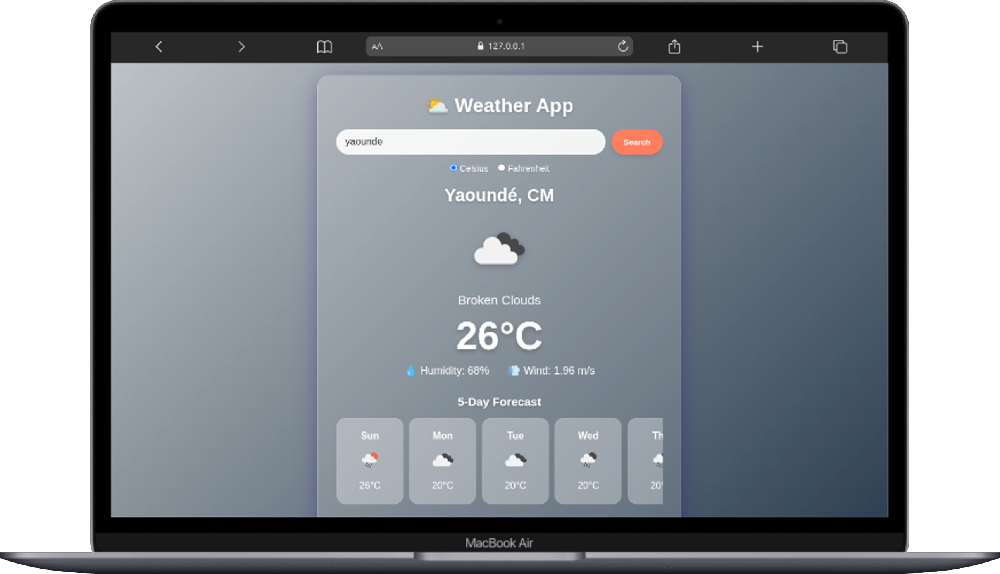

# 🌤️ Weather App — JavaScript Weather Forecast Application

A fully functional weather forecast application built with JavaScript, HTML, and CSS. Users can search for any city worldwide and get real-time weather data including temperature, humidity, wind speed, and a 5-day forecast using the OpenWeatherMap API.

---

## 🎯 Project Goals

This project aims to:

- Practice working with external APIs using the Fetch API
- Implement Local Storage for data persistence
- Build a responsive, user-friendly interface
- Handle errors gracefully with user feedback
- Create dynamic UI updates based on weather conditions

---

## 🚀 Key Features

### Search by City

- Users enter a city name and click search or press Enter
- Fetches real-time weather data from OpenWeatherMap API
- Displays city name, country, temperature, weather description, and icon

### Current Weather Display

- Temperature in Celsius or Fahrenheit (toggle option)
- Weather description (e.g., "clear sky")
- Humidity percentage
- Wind speed (m/s or mph)
- Weather icon from OpenWeatherMap

### 📅 5-Day Forecast

- Displays a 5-day weather forecast
- Shows daily temperature and weather icon
- Updates automatically with unit toggle

### 💾 Local Storage

- Saves the last searched city automatically
- Automatically loads the last city's weather on page refresh

### 🔄 Error Handling

- Friendly error messages for:
  - City not found (404)
  - Invalid API key (401)
  - Network or other fetch errors

### 🎨 Dynamic Background

- Background gradient changes based on weather conditions:
  - Clear: Blue gradient
  - Clouds: Gray gradient
  - Rain: Dark blue gradient
  - Snow: Light blue gradient
  - Thunderstorm: Dark gradient
  - Mist/Fog: Muted gradient

### 📱 Responsive Design

- Fully responsive on all screen sizes
- Optimized for mobile, tablet, and desktop

### 🌡️ Temperature Unit Toggle

- Switch between Celsius and Fahrenheit
- Updates all temperatures instantly

---

## 🛠️ Tech Stack

### Languages

- HTML5
- CSS3
- JavaScript (ES6 Modules)

### APIs

- OpenWeatherMap Current Weather API
- OpenWeatherMap 5-Day Forecast API

### CSS Techniques Used

- CSS Gradients
- Flexbox
- Backdrop Filter (Glassmorphism)
- CSS Transitions & Animations
- Media Queries

### JavaScript Features

- ES6 Modules (import/export)
- Async/Await with Fetch API
- Local Storage API
- DOM Manipulation
- Event Listeners

---

## 🖥️ Features Overview

### 🌐 Core Features

- ✅ City search with Enter key support
- ✅ Current weather display
- ✅ 5-day forecast
- ✅ Temperature unit toggle (°C/°F)
- ✅ Local Storage persistence
- ✅ Error handling with user-friendly messages
- ✅ Weather-based dynamic backgrounds
- ✅ Responsive design (mobile-first)

### 🎨 UI/UX Features

- Glassmorphism card design
- Smooth background transitions
- Weather icons from OpenWeatherMap
- Hover and active states on buttons
- Scrollable forecast container
- Animated error messages

---

## 🔗 API Reference

### OpenWeatherMap API

- **Current Weather:** [https://api.openweathermap.org/data/2.5/weather](https://api.openweathermap.org/data/2.5/weather)
- **5-Day Forecast:** [https://api.openweathermap.org/data/2.5/forecast](https://api.openweathermap.org/data/2.5/forecast)
- **API Key Required:** Sign up at [OpenWeatherMap](https://openweathermap.org/api)

---

## 📐 Responsive Breakpoints

| Breakpoint | Target Device |
| ≤ 600px | Mobile phones |
| 601px - 768px | Tablets |
| ≥ 769px | Desktops |

---

## 📷 Page Preview

### Desktop View



### Mobile View

.png)

### Weather States

- Sunny/Clear
- Cloudy
- Rainy
- Snowy
- Thunderstorm
- Misty

---

## 📂 Project Structure

```text
weather-app/
├── assets
│   └── images
│       ├── iPhone-13-PRO-127.0.0.1 (1).png
│       └── Macbook-Air-127.0.0.1.png
├── config.js
├── index.html
├── README.md
├── script.js
└── style.css
```

---

## 🚀 Getting Started

### Prerequisites

- OpenWeatherMap API key (free sign-up required)
- Modern web browser (Chrome, Firefox, Edge)

### Installation

1. **Clone the repository:**

```bash
git clone https://github.com/your-username/weather-app.git
cd weather-app
```

1. **Get your API Key:**
   - Go to [OpenWeatherMap](https://openweathermap.org/api)
   - Sign up for a free account
   - Copy your API key from the dashboard

1. **Configure the API Key:**
   - Open `config.js`
   - Replace the existing key with your own:

```javascript
export const API_KEY = "YOUR_API_KEY_HERE";
```

1. **Run the application:**
   - Simply open `index.html` in any browser
   - Or use a live server extension in VS Code

```bash
# Using VS Code Live Server
Right-click index.html → Open with Live Server

# Or simply
open index.html
```

No build tools, no dependencies — just open and go!

---

## 🧠 Challenges Faced

- **CORS Issues:** Resolved by using proper API endpoints and handling fetch errors
- **Local Storage Persistence:** Implemented save/load functionality for last searched city
- **5-Day Forecast Filtering:** Filtered API data to show one forecast per day
- **Dynamic Backgrounds:** Mapped weather conditions to gradient backgrounds
- **Unit Toggling:** Ensured all temperature and wind speed units update correctly
- **Responsive Design:** Made layout work seamlessly across all screen sizes

---

## 📚 What I Learned

- Working with external APIs using `fetch()` and `async/await`
- Managing API keys securely in a separate config file
- Implementing Local Storage for data persistence
- Handle API errors and provide user feedback
- Create dynamic UI updates based on data
- Build a responsive single-page
- Use ES6 modules
- Implementing glassmorphism design with CSS

---

## 🚀 Future Improvements

- Add autocomplete suggestions for city names
- Integrate geolocation API for automatic location detection
- Implement dark/light theme toggle

---

## 👨🏽‍💻 Author

**Kembou Keumoe Ivan Michael**
Junior Fullstack Developer

📩 Email: <kman39457@email.com>

🌍 Based in Cameroon | Open to remote opportunities

---

## 🙏 Acknowledgments

- [OpenWeatherMap](https://openweathermap.org/) for providing the free weather API
- Font Awesome for the icons used in the UI
- All contributors and testers who helped improve this application
